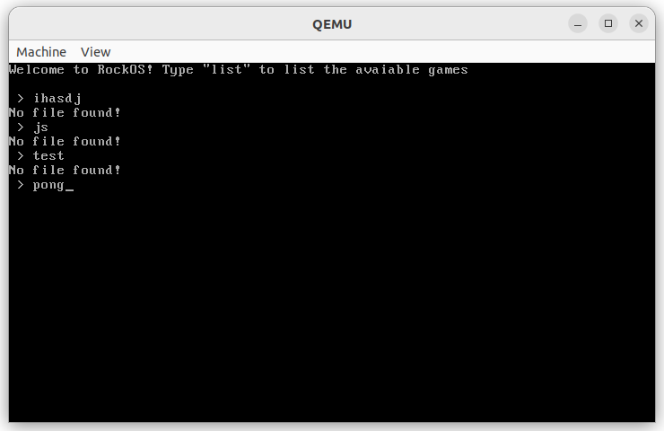
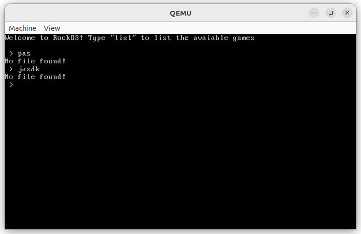
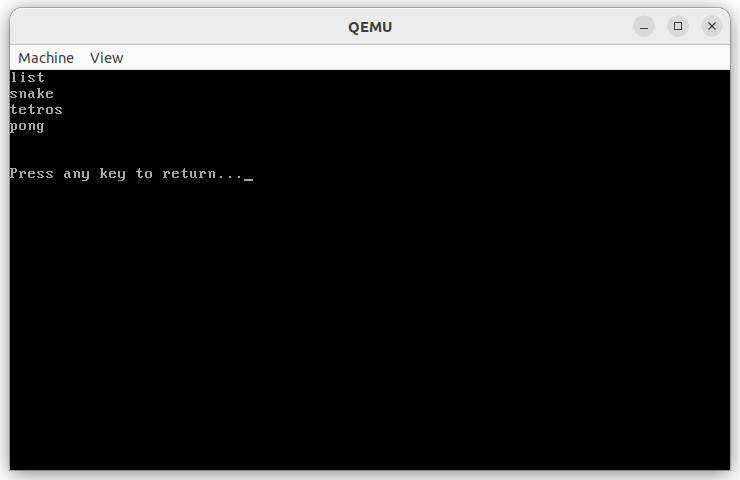
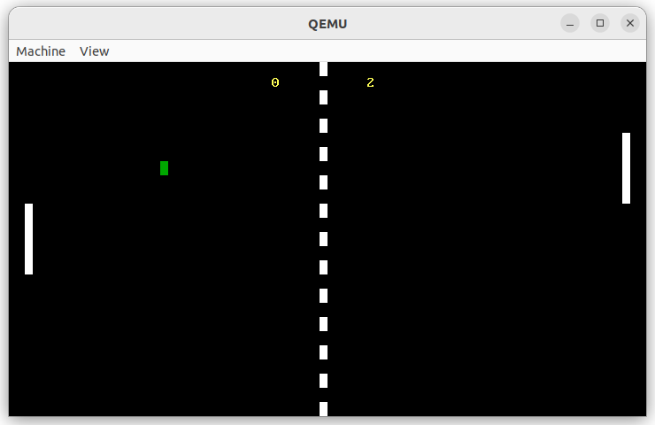

# RockOS

## Description:

This is a mini project of creating an operating system from scratch using all my knowage in computer architerture and operating systems. I'm using assembly x86 in 16 bit real mode togehter with mashine code.



## RAM Memory table:

| Start       | End         | Size        | Desc.      |
| ----------- | ----------- | ----------- | ---------- |
| 0x0000_0500 | 0x0000_7BFF | 30463 bytes | Stack      |
| 0x0000_7C00 | 0x0000_7DFF | 512 bytes   | Bootloader |
| 0x0000_7E00 | 0x0000_7FFF | 512 bytes   | Files      |
| 0x0000_8000 | 0x0000_81FF | 512 bytes   | Shell      |

## Floppy image map:

| Start       | End         | Size      | Description | Sector |
| ----------- | ----------- | --------- | ----------- | ------ |
| 0x0000_0000 | 0x0000_01FF | 512 bytes | bootloader  | 0      |
| 0x0000_0200 | 0x0000_03FF | 512 bytes | files       | 1      |
| 0x0000_0400 | 0x0000_05FF | 512 bytes | shell       | 2      |
| 0x0000_0600 | 0x0000_07FF | 512 bytes | ls          | 3      |
| 0x0000_0800 | 0x0000_09FF | 512 bytes | snake       | 4      |
| 0x0000_0A00 | 0x0000_0BFF | 512 bytes | tetros      | 5      |
| 0x0000_0C00 | 0x0000_0DFF | 512 bytes | pong        | 6      |

---

### Goals:

The main goal of RockOS is to be able to run on ony computer (regadless of architecture) and also virtually (using virtual machine).

**Other goals**:

- [ ] create and run thirth party software (custome made apps)

- [ ] create and save binary files

- [ ] create and save text files

- [ ] connection to inthernet/ethernet

- [ ] access to disks (mounting/dismounting)

- [ ] graphical interface (desktop and mouse)

- [ ] ect

---

## Download:

Get the version you like: [Releases · kamkanev/RockOS · GitHub](https://github.com/kamkanev/RockOS/releases)

## Build it yourself

### Preparations:

#### Windows (unavaiable for now)

#### Linux:

Install NASM for assembly x86:

    For Debian, Ubuntu, Linux Mint 

```batch
sudo apt install nasm
```

    For RHEL, Fedora, AlmaLinux:

```batch
sudo dnf install nasm
```

    For Arch, Manjaro, EndeavourOS

```batch
sudo pacman -S nasm
```

Install QEMU simulator:

    More information here: [Download QEMU for Linux](https://www.qemu.org/download/#linux)

```batch
sudo apt-get install qemu-system
sudo pacman -S qemu
sudo dnf install @virtualization
```

### Installation:

Download the github repo:

```batch
gh repo clone kamkanev/RockOS
```

```batch
git clone https://github.com/kamkanev/RockOS.git
```

Go into the folder of the project and run the Makefile:

```batch
cd RockOS    
```

```batch
make
```

    After running the command you should get a **.img** file.

    Alternativly using the following command you can get a **.iso** file.

```batch
make iso
```

   You can either run the files on a virtual machine or in [Virtual x86](https://copy.sh/v86/) or you can run the following command to run the OS in QEMU simulator.

```batch
make run
```



```batch
make iso-run
```

To clean up use:

```batch
make clean
```

```batch
make iso-clean
```

---

## Usage:

At the momment the only working commands are `list` and all the commands use see there:






## Problems:

- [ ]  Not all games return you the shell

- [ ]  Can't load files/games larger than **512bytes**.

- [ ]  Optimize the **stack** and **heap**
